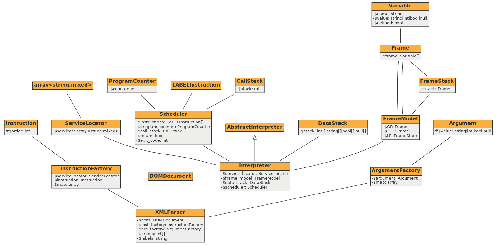

Implementační dokumentace k 2. úloze do IPP 2023/2024
Jméno a příjmení: Jakub Všetečka
Login: xvsete00

- [Návrh](#návrh)
- [Interní reprezentace](#interní-reprezentace)
	- [`Interpreter`](#interpreter)
	- [`XMLparser`](#xmlparser)
	- [`ArgumentFactory`](#argumentfactory)
	- [`InstructionFactory`](#instructionfactory)
	- [`Frame`](#frame)
	- [`FrameStack`](#framestack)
	- [`FrameModel`](#framemodel)
	- [`Variable`](#variable)
	- [`DataStack`](#datastack)
	- [`ServiceLocator`](#servicelocator)
	- [`ProgramCounter`](#programcounter)
	- [`CallStack`](#callstack)
	- [`Scheduler`](#scheduler)
- [Implementace](#implementace)
- [Literatura](#literatura)


## Návrh
Při řešení tohoto projektu bylo mým cílem nejen rozšířit ipp-core o funkční implementaci interpretu pro XML reprezentaci jazyka IPPcode24, ale zaměřit se i na její škálovatelnost (přidávání nových instrukcí, či argumentů) a čitelnost.

Proto jsem se při návrhu objektového modelu interpretu rozhodl za použití známých paradigmat jako zapouzdření a dědičnost vytvořit vlastní podtřídu pro každou instrukci:


Stejně jsem postupoval i při návrhu schématu argumentů.


Za konstrukci instancí třídy `Argument` a `Instruction` a jejích podtříd jsou zodpovědné třídy [`ArgumentFactory`](#argumentfactory) a [`InstructionFactory`](#instructionfactory). Tyto třídy proces tvorby argumentů a instrukcí unifikují a odpovídají tak návrhovému vzoru `Builder` (podle [1](#literatura)).

Samotný běh programu je potom možné rozdělit do dvou částí:
1. zpracování XML reprezentace kódu a vytvoření seznamu instrukcí
2. Iterativně procházet instrukce a volání jejich metody `execute`


## Interní reprezentace
V téhle části se zaměřím na detailnější popis struktury tříd a jejich vzájemné interakce



Z diagramu tříd byly pro přehlednost vynechány metody, již zmíněné třídy instrukcí a argumentů a implementované třídy`Exception.

#### `Interpreter`
`Interpreter` má na starosti odchycení výjimek. Dále vytváří instanci [`ServiceLocator`](#servicelocator) a předává jí služby potřebné při vykonávání instrukcí:
```php
$service_locator->register('frame_model', $this->frame_model);
$service_locator->register('data_stack', $this->data_stack);
$service_locator->register('scheduler', $this->scheduler);
$service_locator->register('stdout', $this->stdout);
$service_locator->register('stderr', $this->stderr);
$service_locator->register('stdin', $this->input);
```
Tento objekt potom předává argumentem [`XMLparser`](#xmlparser). Následně volá metodu:
```php
$this->scheduler->run();
```

#### `XMLparser`
Tato třída je zodpovědná za zpracování vstupních dat. K tvorbě argumentů a instrukcí využívá [`ArgumentFactory`](#argumentfactory) a [`InstructionFactory`](#instructionfactory). Také má na starosti seřazení pole instrukcí podle `order`, kontrolu duplicitních `order` a kontrolu duplicitních návěští.

#### `ArgumentFactory`
V téhle části se provádí typová kontrola argumentů a instancializace odpovídajících objektů. K ověření hodnoty parametru je k dispozici seznam `$map`, který obsahuje podporované typy argumentů a vhodný regex určený pro validaci.
```php
private static array $map = [
        'string' => ['pattern' => '/^(?:[^\\\\#\s]|\\\\[0-9]{3})*$/',
					  'cast' => ConstantArgument::class],
        'int' => ['pattern' => '/^[-+]?\d+$/',
		          'cast' => ConstantArgument::class],
        'bool' => ['pattern' => '/^true|false$/',
		           'cast' => ConstantArgument::class],
        'nil' => ['pattern' => '/^nil$/',
			      'cast' => ConstantArgument::class],
        'label' => ['pattern' => '/^[\w\-]+$/',
			        'cast' => LabelArgument::class],
        'type' => ['pattern' => '/^int|bool|string|nil$/',
			       'cast' => TypeArgument::class],
        'var' => ['pattern' => '/^(GF|TF|LF)@[\w\-]+$/',
			       'cast' => VariableArgument::class],
    ];
```

#### `InstructionFactory`
`InstructionFactory` vytváří objekty typu konkrétní podtřídy třídy `Instruction`. Za pomoci seznamu `$map` přiděluje instrukcím potřebné služby ze [`ServiceLocator`](#servicelocator).
```php
private static array $map = [
        'ADD' => ['class' => ADDInstruction::class, 'services' => ['frame_model']],
        'SUB' => ['class' => SUBInstruction::class, 'services' => ['frame_model']],
        'MUL' => ['class' => MULInstruction::class, 'services' => ['frame_model']],
        ...
```

#### `Frame`
`Frame` reprezentuje paměťový rámec. Je implementován jako zásobník objektů typu `Variable`.

#### `FrameStack`
Tato třída je implementována jako zásobník objektů typu `Frame`

#### `FrameModel`
`FrameModel` odpovídá návrhovému vzoru `Facade`(podle [[#^d8750b]] ). Obsahuje rámce [`Frame`](#frame) pro GF a LF a zásobník rámců [`FrameStack`](#framestack) pro LF. Tato třída představuje zapouzdření vnitřní práce s paměťovým model jazyka IPPcode24  a umožňuje instrukcím snadnou práci s proměnnými pouze na základě jejich jména a rámce.

#### `Variable`
`Variable` je pomocná třída umožňující ukládání informací do [`Frame`](#frame).

#### `DataStack`
`DataStack` představuje datový zásobník.

#### `ServiceLocator`
Třída obsahující seznam služeb potřebných pro vykonávání instrukcí. Tento objekt je postupně předáván od [`Interpreter`](#interpreter) přes [`XMLParser`](#xmlparser) až po [`InstructionFactory`](#instructionfactory), kde se konkrétní služby přidělí konstruktoru odpovídající instrukce. Služby jsou typu:
- `FrameModel`
- `DataStack`
- `Scheduler`
- `OutputWriter`
- `InputReader`

#### `ProgramCounter`
`ProgramCounter` implementuje programový čítač, který obsahuje index právě prováděné instrukce.

#### `CallStack`
Tato třída představuje zásobník indexů pole instrukcí.

#### `Scheduler`
`Scheduler` zajišťuje provádění instrukcí ve správném pořadí. Pomocí [`ProgramCounter`](#programcounter) vybírá následující instrukci, co se má vykonat, a volá její metodu `execute`. Tato třída zároveň poskytuje instrukcím, které mění běh programu, rozhraní ve formě metod:
- `call(label)`
- `ret()`
- `jump(label)`
- `exit(value)`
## Implementace
Implementace odpovídá základnímu zadanání a to v plné formě. Žádná bonusová řešení nebyla implementována.
## Literatura

1. Gamma, E., Helm, R., Johnson, R., Vlissides, J.: Design Patterns – Elements of Reusable Object-Oriented Software, Addison Wesley, 1995.